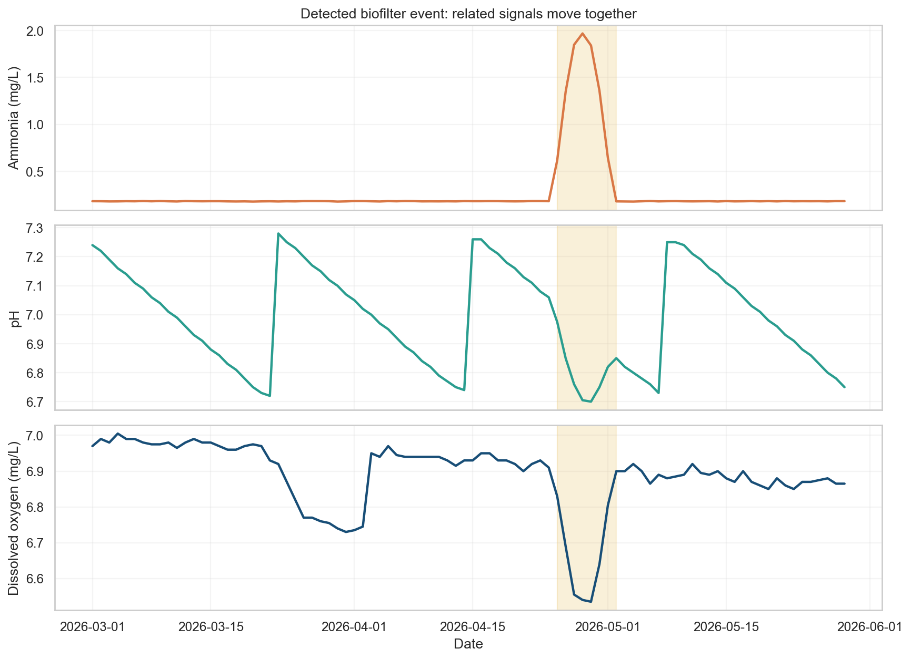
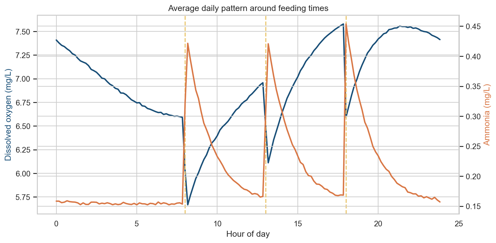

# Water-quality sensor analysis for a tilapia RAS

This project analyses 90 days of synthetic sensor data from four tanks in a recirculating aquaculture system (RAS). I created it to practise the main tasks I would expect in a junior data scientist role: checking data quality, cleaning a messy CSV, exploring time-series patterns and building an explainable rolling z-score baseline.

The data is synthetic, so the unusual events are known. That gives me a clear way to check whether my analysis finds the right patterns.

## What I found

- The raw file had **51,865 rows**. After fixing tank labels and removing 25 duplicate rows, it had the expected **51,840 unique readings**.
- I found missing data, impossible DO and flow readings, a stuck pH sensor, a temperature calibration shift and a drifting DO probe.
- A rolling z-score baseline highlighted the biofilter problem beginning on **25 April 2026**. Ammonia rose across all four tanks while pH and dissolved oxygen fell.
- Final validation against held-back truth detected **8/8 injected fault categories** and recovered the seven-day event window. The truth CSV is used only in the last scoring cell and is excluded from Git.



The most useful lesson was that a sensor fault usually affected one measurement on one tank, while the process problem affected several related measurements across all tanks.

## View the notebooks

- [01 — Data cleaning](notebooks/01_cleaning.ipynb): structure, missingness, validity checks and sensor-quality flags.
- [02 — Analysis](notebooks/02_analysis.ipynb): EDA, feeding cycles, rolling z-score baseline and held-back scoring.

The baseline uses the previous 21 days and applies `.shift(1)`, so the day being scored is not included in its own reference window.

## Normal daily behaviour

The system is fed at 08:00, 13:00 and 18:00. After feeding, ammonia rises and dissolved oxygen falls. This relationship appears clearly when readings are grouped by time of day.



## Project files

```text
data/
  ras_sensors_dirty.csv       original shuffled data
  ras_sensors_clean.csv       cleaned data created by notebook 1
images/                       charts used in this README
notebooks/
  01_cleaning.ipynb           data checks and cleaning
  02_analysis.ipynb           EDA and simple anomaly detection
requirements.txt              Python packages
INTERVIEW_NOTES.md            short explanation of my choices
```

## How to run

```bash
python -m venv .venv
source .venv/bin/activate     # Windows: .venv\Scripts\activate
pip install -r requirements.txt
jupyter lab
```

Run `01_cleaning.ipynb` first, followed by `02_analysis.ipynb`.

## Tools used

- Python
- pandas and NumPy
- Matplotlib and seaborn
- Jupyter Notebook

## Limitations

This is synthetic data and is much cleaner than a full production system. With real farm data, I would validate findings against feeding records, maintenance logs and operator notes. I would also test alert thresholds on a longer period before using them in operations.

An Isolation Forest comparison is a possible version-two extension. This junior project deliberately establishes a transparent statistical baseline first.
